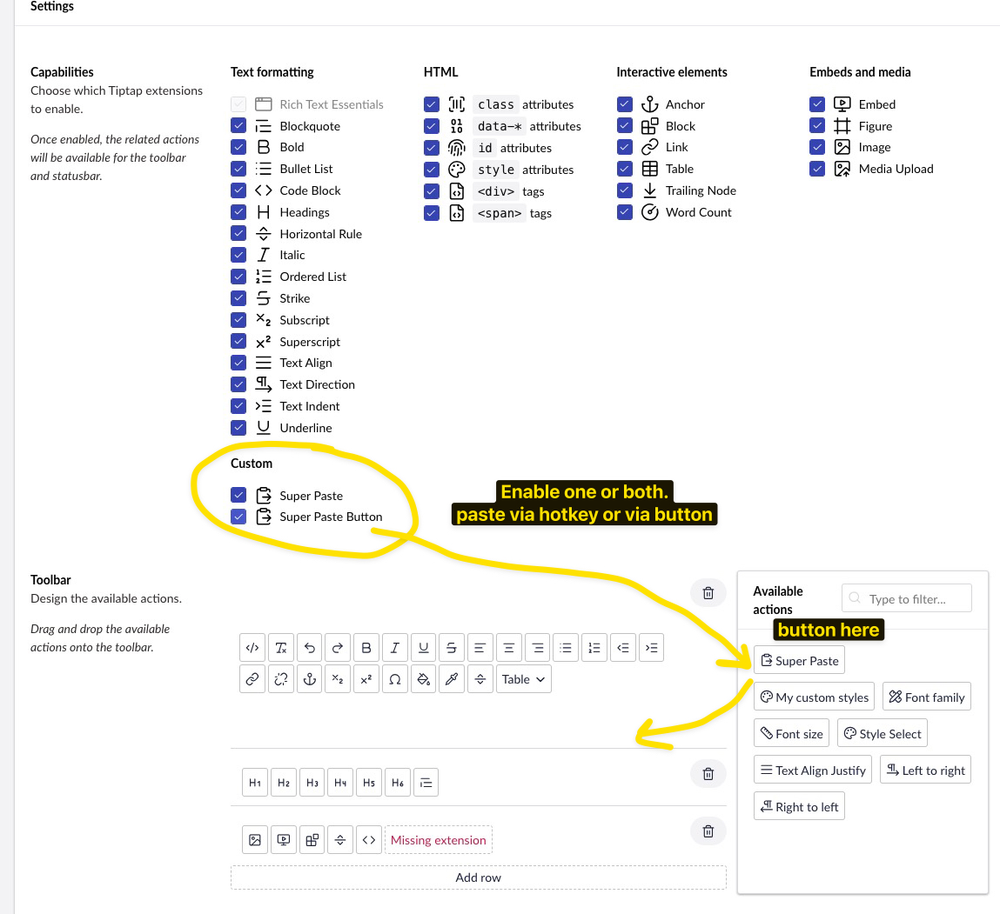
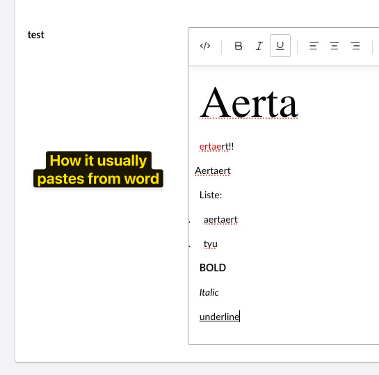
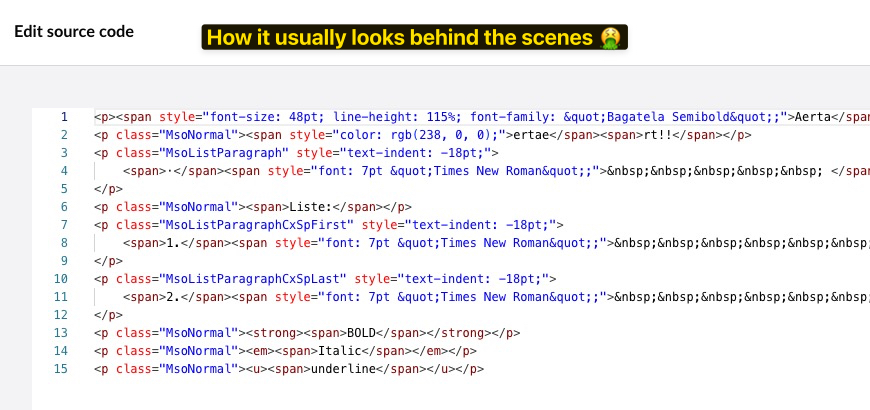
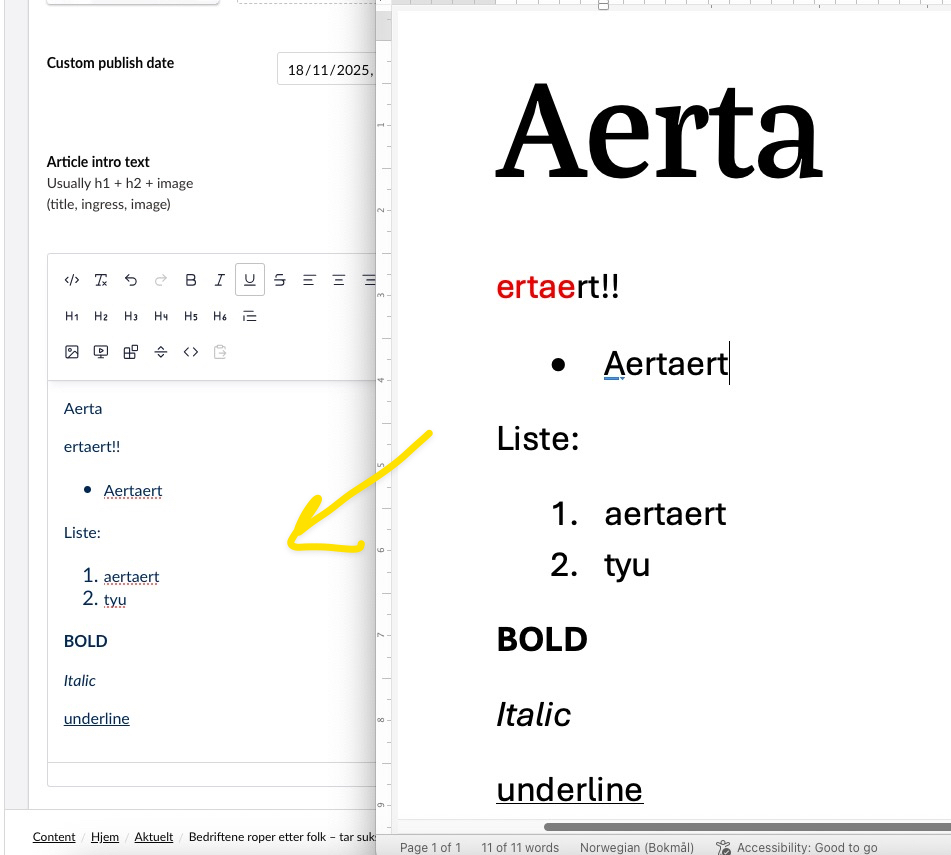

# Tiptap Better Paste plugin for Umbraco

## Inspired by:
- [tiptap-extension-office-paste](https://github.com/Intevation/tiptap-extension-office-paste)
- [tiptap-clean-paste](https://github.com/unicscode/tiptap-clean-paste)

## How to install:
Just simply download and put `TipTapSuperPaste` into your App_plugins in Umbraco. 
you only really need:
`TipTapSuperPaste/dist` and `TipTapSuperPaste/umbraco-package.json` 
`TipTapSuperPaste/client`is only needed when you want to make changes to code.

## What it does:
Better formatting of text when pasting.
Removes unecessary junk and formats microsoft word as list instead of:
`

`

## How to make changes
1. cd into `App_Plugins/TipTapSuperPaste/client``
2. run `npm install``
3. run `npm run watch` `// This will build to /dist and watch for changes`

## How it works:
Either use as a custom paste button, or override result of normal hotkey paste.

## Example images

